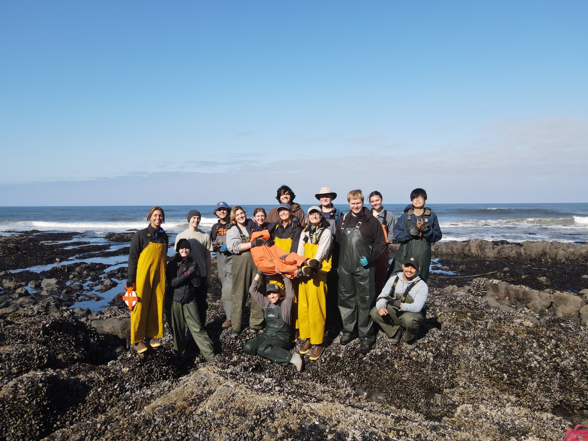

# Current Work

     
I'm a first-year graduate student in the Marine Landscape Ecology Lab at the University of Washington - School of Aquatic and Fishery Sciences. 
My focal research is about evaluating the role of habitat complexity in rocky intertidal disturbance regimes. My intent is to use a combination of fieldwork, aerial imaging, GIS, and modeling to disentangle the relationships between habitat complexity, disturbance, and biodiversity in a dynamic marine landscape.  

# Partnership for Interdisciplinary Studies of Coastal Oceans (PISCO) 

Before attending UW, I was a Faculty Research Assistant with the Lubchenco-Menge Lab at Oregon State University. Under the guidance of Dr. Bruce Menge and Dr. Sarah Gravem, I led a mussel mortality project and helped manage the field operations as a branch of The Partnership for Interdisciplinary Studies of Coastal Oceans (PISCO). Prior to this, I was a seasonal research assistant for the lab and PISCO, conducting rocky intertidal fieldwork in Oregon and California. 

# Undergraduate Research
I received my B.S. in Biology from Oregon State University in 2022. As part of my academic journey, I was a undergraduate research fellow studying the reproductive timing of the critically endangered sunflower sea star, *Pycnopodia helianthoides*. 
